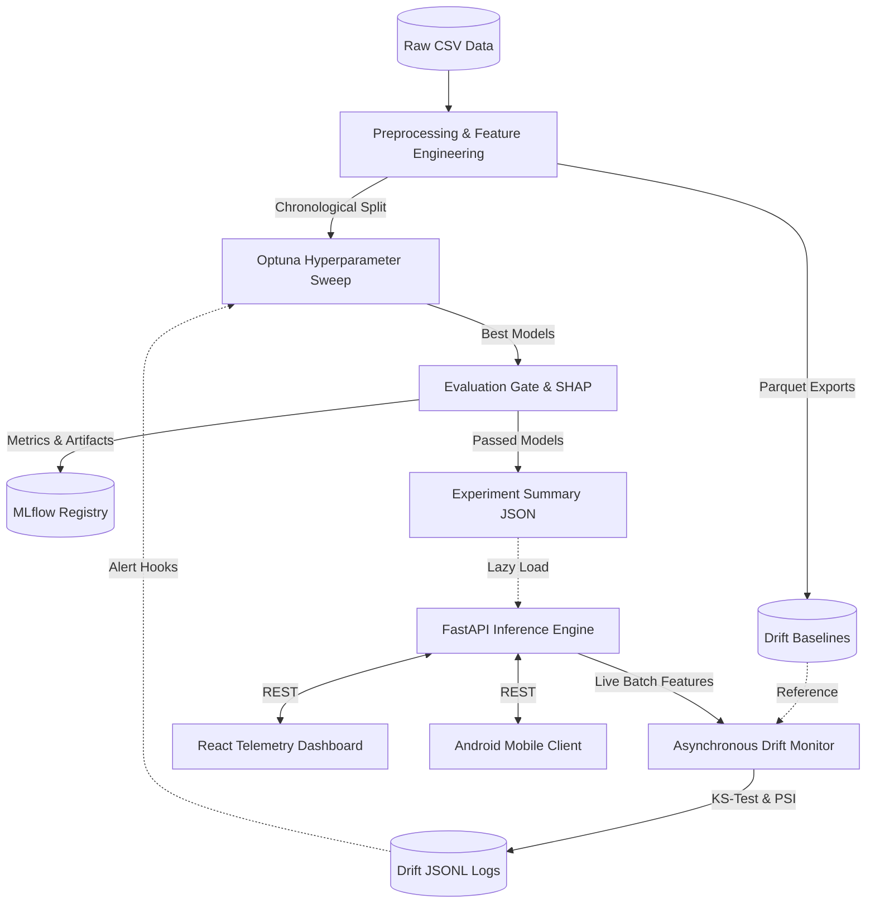

# 🌪️ AeroSense: Production MLOps PM2.5 Forecasting


**AeroSense** is an end-to-end, production-grade Machine Learning pipeline designed to forecast PM2.5 air quality concentrations in Delhi, India. It features a fully automated MLOps lifecycle: from cyclical feature engineering and Optuna hyperparameter sweeps to automated MLflow registry gating, real-time asynchronous drift monitoring, and a unified React/FastAPI telemetry dashboard.

---

## 🏗️ System Architecture



---

## 🚀 Quickstart & Deployment

AeroSense uses a multi-stage Docker build to package both the React frontend and the Python FastAPI backend into a single lightweight image, accompanied by a dedicated MLflow tracking server.

### Option 1: Docker Compose (Production Mode)
```bash
# Build and spin up the entire stack
docker-compose up --build
```


### Option 2: Local Development Mode (Hot Reloading)
```bash
# Terminal 1: Start the MLflow Server
mlflow server --host 0.0.0.0 --port 5000

# Terminal 2: Start the FastAPI Backend
uvicorn src.api.app:app --host 0.0.0.0 --port 8000 --reload

# Terminal 3: Start the Vite React Frontend
cd frontend
npm install
npm run dev
```

---

## 🧠 The MLOps Pipeline

### 1. Data Processing & Experimentation (`src/experimentation/`)
* **Cyclical Temporal Encoding**: Transforms hours, days, and months into `sin`/`cos` waves.
* **Vectorized Wind Mapping**: Converts scalar wind speed and direction into `wind_x` and `wind_y`.
* **Chronological Splits**: Data is strictly split chronologically per season to prevent data leakage.
* **Tuning**: Optuna runs `TimeSeriesSplit` cross-validation across `LightGBM`, `XGBoost`, `CatBoost`, and `RandomForest` candidates for each season.

### 2. Evaluation Gate (`src/evaluation/`)
Models must pass rigorous criteria before being promoted to the API:
* **RMSE Threshold:** Must be `< 50.0 µg/m³`.
* **Persistence Test:** Must outperform a naive 1-hour persistence baseline.
* **R² Threshold:** Must maintain `> 0.70`.
* **Explainability:** Automatically generates SHAP beeswarm, waterfall, and residual plots for registered artifacts.

### 3. Real-Time Drift Telemetry (`src/monitoring/`)
* Runs asynchronously using FastAPI `BackgroundTasks` to ensure zero latency impact on live inferences.
* Computes **Kolmogorov-Smirnov (KS)** tests (p < 0.05) and **Population Stability Index (PSI)** (threshold > 0.25).
* Logs structured events to rotating `.jsonl` files (`logs/drift_alerts/`) and triggers webhook callbacks (e.g., initiating automated retraining).

---

## 🔌 API Reference

### Core ML Endpoints (Used by MLOps & React UI)
| Method | Endpoint | Description |
|--------|----------|-------------|
| `POST` | `/predict` | Predict PM2.5 for a single observation using the active seasonal model. |
| `POST` | `/predict-batch` | Batch inference. **Triggers background drift monitoring** if `n >= 5`. |
| `GET`  | `/health` | Core system health, loaded models array, and latest drift severity. |
| `GET`  | `/model-info` | Returns active MLflow artifacts currently loaded in memory. |

### Mobile Client Endpoints (Used by AeroSense Android App)
| Method | Endpoint | Description |
|--------|----------|-------------|
| `GET`  | `/current` | Returns current Delhi PM2.5, weather block, and a contextual insight. |
| `GET`  | `/forecast` | Returns a synthetic multi-hour time-series forecast array. |
| `GET`  | `/model-status`| Returns the simplified production model performance struct. |
| `GET`  | `/drift-history`| Parses physical logs to return a timeseries array of historical KS statistics. |
| `POST` | `/retrain` | Triggers a background subprocess to execute the Optuna training sweep. |
| `POST` | `/copilot` | Dedicated RAG/LLM endpoint strictly scoped to Delhi PM2.5 interpretation. |

---

## 📂 Project Structure

```text
AeroSense/
├── baselines/                   # Exported Parquet reference datasets for Drift Detection
├── data/raw/                    # Raw CSV PM2.5 datasets
├── frontend/                    # Vite + React + TailwindCSS SPA
│   ├── src/components/          # Modular UI (Sidebar, InferenceTab, DriftTab)
│   └── package.json
├── logs/drift_alerts/           # JSONL physical audit trail for drift monitoring
├── models/                      # Pickled joblib models and experiment_summary.json
├── reports/plots/               # SHAP and Residual PNGs generated by Evaluator
├── scripts/                     # Smoke tests and CI/CD validation scripts
├── src/
│   ├── api/                     # FastAPI App, Pydantic Schemas, Inference Service
│   ├── evaluation/              # Model Gate, MLflow Registry, and SHAP Plotting
│   ├── experimentation/         # Optuna Tuner, Pipeline Runner
│   ├── monitoring/              # KS-Test/PSI Detector, Async Batch Monitor
│   └── preprocessing.py         # Pipeline core feature engineering
├── .github/workflows/ci.yml     # GitHub Actions CI/CD rules (Ruff, Black, Pytest)
├── docker-compose.yaml          # Unified production orchestration
└── Dockerfile                   # Multi-stage (Node -> Python) build instruction
```
